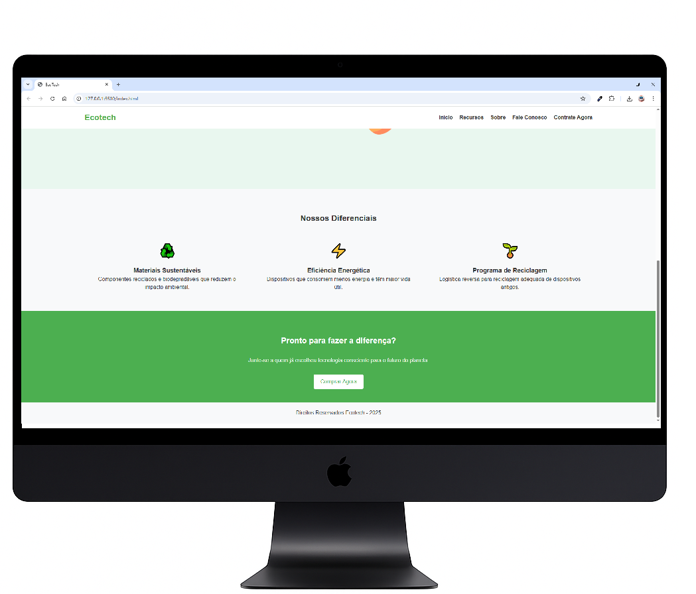
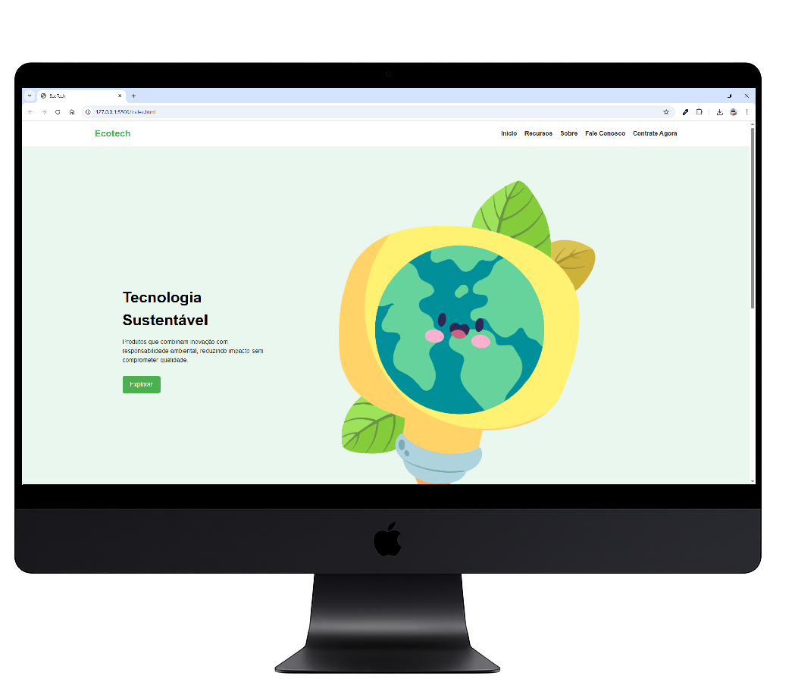
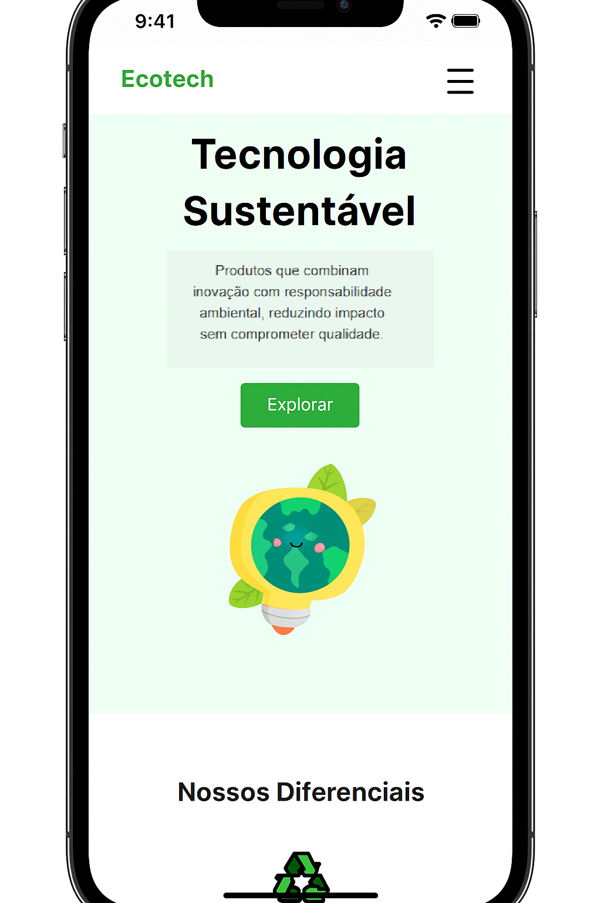
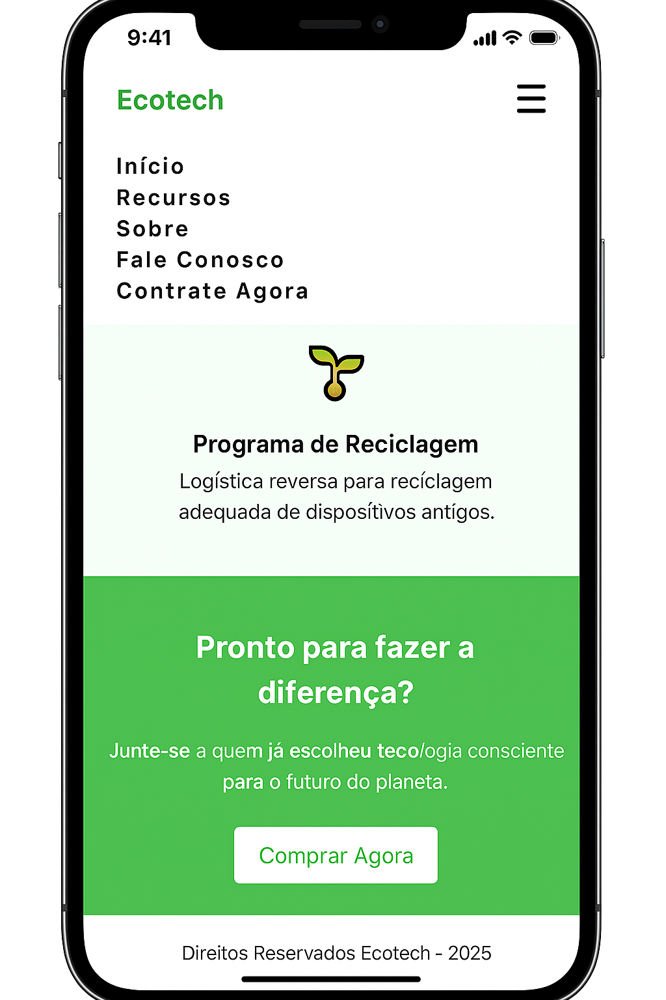

# 🌱 Primeiro Projeto Responsivo - EcoTech

Este é um projeto simples de site responsivo com tema de **tecnologia sustentável**, criado para treinar HTML e CSS, com foco principal em **responsividade**.
O objetivo foi desenvolver uma página moderna, acessível em diferentes tamanhos de tela, e com conteúdo visual atrativo.

---

## 💻 Versão Desktop

Visualização do site em tela cheia (computador):

  
  

---

## 📱 Versão Responsiva (Mobile)

Visualização adaptada para celulares:

  
  

---

## 🛠️ Tecnologias Utilizadas

- HTML5
- CSS3
- Responsividade com media queries
- Organização semântica e acessível

---

## Você pode visualizar meu site em:

https://adriciachiarini.github.io/primeiro-projeto-responsivo/
